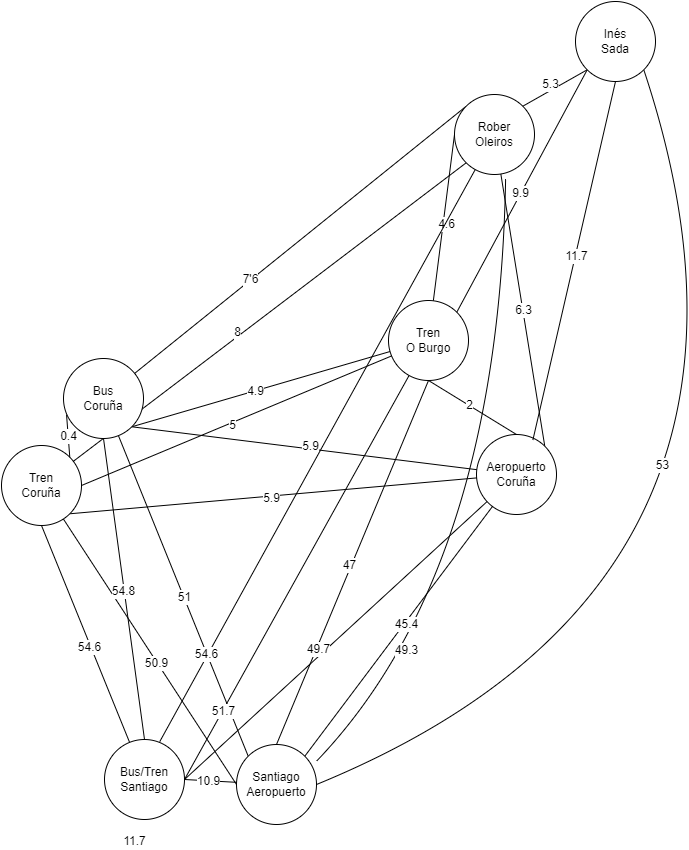

# CoWalker

Esta aplicación se encarga de realizar planes de viajes minimizando el impacto ambiental. 

## Glosario

- Grupo: conjunto de personas que quieren ir de viaje juntos.
- Miembro: persona perteneciente a un grupo.

## Características

- Todos los miembros de un grupo tienen que tener el mismo vuelo, es decir, tener un vuelo de un sitio A a un sitio B y el objetivo es que todos los miembros vayan al sitio A
- Si dos miembros están cercanos el algoritmo tratará de juntarlos y pasan a ser 1 a ojos del algoritmo.
- Se considera que 2 miembros están cercanos si están a menos de 50km a la redonda. Este kilometraje aumenta (sumando) al unirse 2 miembros. Por ejemplo, si Ana y Juan están a 10km a la redonda, van a un punto de encuentro, se une su límite 50+50=100km y si Felipe está a 60km de distancia se une a ellos también.
- Se establece un límite de 2km a la redonda para caminar, si se pasa de ese límite el algoritmo buscará una forma para que vaya en transporte público.

## Modo de uso
- Instalar los requerimientos
```
pip install -r requirements.txt
```
- Ejecutar el archivo app.py
```
python app.py
```
- Se abrirá un servidor en https://localhost:5000 en el que se podrá elegir destino, número de integrantes del grupo y nombre del viaje.
- En la siguiente ventana se elegirá el punto de partida de cada integrante del grupo.
- En la última ventana se verá el trayecto de los integrantes del grupo.

## Qué funciona
- El ejemplo de juguete: ```ejemplo2pers.py```, con el ```ejemplo.json``` que sigue el esquema ```schema-json.json```. Están en la carperta **.Clases.**
- La interfaz gráfica
- La creación de grafos

## Contribuciones
- Para contribuir, crea una nueva branch e introduce el código deseado. Tras revisar el código, veremos si se incluye el nuevo código.

## Contribuidores
- Elena Fernández del Sel
- Nicolás Fernández Otero
- Inés Quintana Raña
- Roberto Tato Lage

## Futuras mejoras
- Elegir el coche que tienes porque el consumo varía.
- Considerar nuevos transportes, por ejemplo, buses o barcos.
- Optimizar el algoritmo de búsqueda
- Unión de la interfaz gráfica con el algoritmo

## Ejemplos
### 2 personas
Empezamos con un ejemplo sencillo donde 2 personas (Inés y Rober) van a ir al Aeropuerto de Santiago, para eso usamos los siguientes nodos y conexiones. El número de las conexiones indica la distancia en kilómetros.


El resultado de la ejecución es el siguiente


## Licencia
MIT

